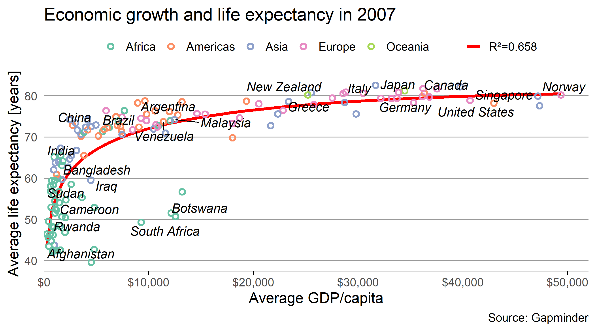

  
  ## Packages and data
```  {r setup, include=FALSE}
library(tidyverse)
library(gapminder)
# Countries to be highlighted
ctr <- c("Afghanistan", "Argentina", "Bangladesh", 
         "Botswana", "Brazil", "Canada", "China",  
         "Cameroon", "Germany", "Greece", "India", 
         "Iraq", "Italy", "Japan", "Malaysia", 
         "New Zealand",  "Norway", "Rwanda", "Singapore", 
         "South Africa", "Sudan", "United States", "Venezuela")
```

## Data subset

```{r data-subset}
# filter observations where the year is 2007 
g07 <- filter(gapminder, year == 2007)
g07
```

## Custom regression fit

```{r custom-regression-model}
# create linear regression model with a simple linear term and a log term
library(parsnip)
m <- linear_reg() %>%
  set_engine("lm") %>%
  set_mode("regression") %>%
  fit(lifeExp ~ gdpPercap + log(gdpPercap), data = g07)
m
glance(m)
# extract R²
mr2 <- round(glance(m)$r.squared)
# apply model to 100 equi-distant values along the range of gdpPercap
test_data <- tibble(gdpPercap = seq(min(g07$gdpPercap), max(g07$gdpPercap), 
                                    length.out = 100))
prd <- m %>%
  predict(new_data = test_data) %>%
  rename(lifeExp = .pred) %>%
  bind_cols(test_data)
prd
```

## The plot

Recreate the following plot:
  
```{r template, echo = FALSE, out.width="100%"}

```

Tips:
  
  - Use the ColorBrewer scale "Set2" for color.
- The x-axis limits are `c(0, 52000)` without expansion factor.
- The x-axis labels are created by `scales::dollar`
- Use `ggrepel::geom_text_repel()` to automatically arrange text labels so that they don't overlap.
- Use `theme_minimal()` as basis theme.

```{r plot, fig.width=9, fig.height=5}
p <- ggplot(g07, aes(x=gdpPercap, y=lifeExp, color=continent))+
  geom_point(aes(color=continent), shape=1, size=2, stroke=1.5)+
  geom_smooth(method = 'lm',
              formula = y ~ x + log(x),
              color = 'red',
              size=1.2,
              se = F)+ 
  scale_color_brewer(palette = "Set2")+
  scale_linetype(labels=paste0("R2=", mr2))+
  ggrepel::geom_text_repel(data = filter(g07, country %in% ctr),
    aes(label=country), color='black',
    size = 14/.pt, fontface = "italic")+
  theme_minimal(base_size = 16/.pt)+
  theme(legend.position = "top")+
  theme(axis.line = element_line(size=.5))+
  theme(axis.ticks = element_line(size=.4))+
  theme(panel.grid.minor = element_blank())+
  theme(panel.grid.major = element_blank())+
  labs(
    x = "Average GDP/capita",
    y = "Average life expectancy [years]",
    title = "Economic growth and life expectancy in 2007",
    linetype = NULL, color = NULL
  )+ 
  scale_x_continuous(
    limits = c(0, 52000),
    expand = c(0,0,0,0),
    labels = scales::dollar 
    )+
  guides(linetype=guide_legend(order=1))

ggsave("myplot.png", plot=p, width = 9, height = 5, dpi = 600)
```