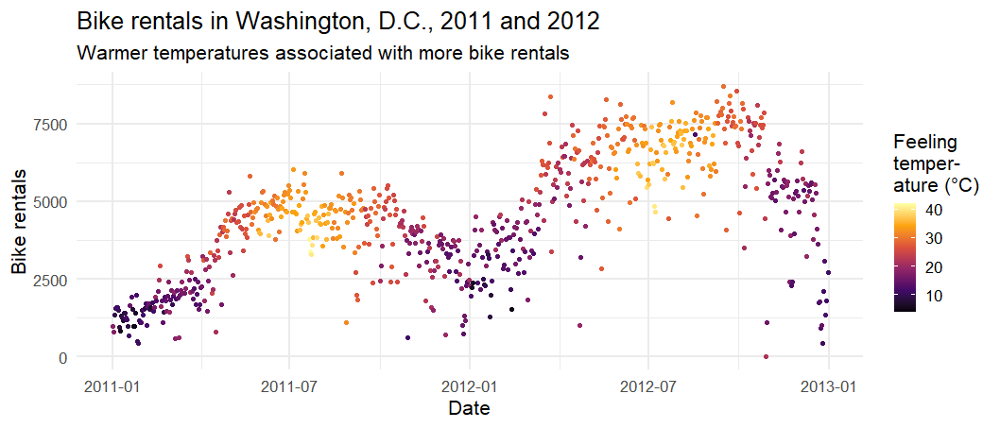

Linear regression - bike rentals in DC
================
Ranji Raj
2021-05-14

> Bike sharing systems are new generation of traditional bike rentals
> where whole process from membership, rental and return back has become
> automatic. Through these systems, user is able to easily rent a bike
> from a particular position and return back at another position.
> Currently, there are about over 500 bike-sharing programs around the
> world which is composed of over 500 thousands bicycles. Today, there
> exists great interest in these systems due to their important role in
> traffic, environmental and health issues.

> Apart from interesting real world applications of bike sharing
> systems, the characteristics of data being generated by these systems
> make them attractive for the research. Opposed to other transport
> services such as bus or subway, the duration of travel, departure and
> arrival position is explicitly recorded in these systems. This feature
> turns bike sharing system into a virtual sensor network that can be
> used for sensing mobility in the city. Hence, it is expected that most
> of important events in the city could be detected via monitoring these
> data.

Dataset and description source:
<http://archive.ics.uci.edu/ml/datasets/Bike+Sharing+Dataset>

Source of assignment tasks 1-15:
<https://github.com/rstudio-education/datascience-box/tree/master/course-materials/starters/hw/hw-07-bike-rentals-dc>

``` r
library(tidyverse)
```

    ## -- Attaching packages --------------------------------------- tidyverse 1.3.0 --

    ## v ggplot2 3.3.3     v purrr   0.3.4
    ## v tibble  3.1.0     v dplyr   1.0.5
    ## v tidyr   1.1.3     v stringr 1.4.0
    ## v readr   1.4.0     v forcats 0.5.1

    ## -- Conflicts ------------------------------------------ tidyverse_conflicts() --
    ## x dplyr::filter() masks stats::filter()
    ## x dplyr::lag()    masks stats::lag()

``` r
theme_set(theme_minimal(base_size = 16))
knitr::opts_chunk$set(fig.width = 28 / 2.54, fig.height = 12 / 2.54)
```

``` r
bikeshare <- read_csv("bike-rentals-day.csv")
```

    ## 
    ## -- Column specification --------------------------------------------------------
    ## cols(
    ##   instant = col_double(),
    ##   dteday = col_date(format = ""),
    ##   season = col_double(),
    ##   yr = col_double(),
    ##   mnth = col_double(),
    ##   holiday = col_double(),
    ##   weekday = col_double(),
    ##   workingday = col_double(),
    ##   weathersit = col_double(),
    ##   temp = col_double(),
    ##   atemp = col_double(),
    ##   hum = col_double(),
    ##   windspeed = col_double(),
    ##   casual = col_double(),
    ##   registered = col_double(),
    ##   cnt = col_double()
    ## )

## Data wrangling

1\. Recode the season variable as a factor with meaningful level names
as outlined in the codebook (*bike-rentals-readme.txt*), with spring as
the baseline level.

``` r
bikeshare <- bikeshare %>%
  mutate(season = factor(
    season,
    levels = c(2,3,4,1),
    labels = c("spring","summer","fall","winter")
  ))
table(bikeshare$season)
```

    ## 
    ## spring summer   fall winter 
    ##    184    188    178    181

2\. Recode the binary variables holiday and workingday to be factors
with levels no (0) and yes (1), with no as the baseline level.

``` r
bikeshare <-
  bikeshare %>%
  mutate(across(c(holiday, workingday), factor, labels=c("no","yes")))
bikeshare$holiday %>% table()
```

    ## .
    ##  no yes 
    ## 710  21

3\. Recode the `yr` variable to be a factor with levels 2011 and 2012,
with 2011 as the baseline level.

``` r
bikeshare <- bikeshare %>%
  mutate(yr = factor(yr, labels = c("2011","2012")))
bikeshare$yr %>% table()
```

    ## .
    ## 2011 2012 
    ##  365  366

4\. Recode the `weathersit` variable as 1 - clear, 2 - mist, 3 - light
precipitation, and 4 - heavy precipitation, with clear as the baseline.

``` r
bikeshare <- bikeshare %>%
  mutate(weathersit = factor(weathersit, levels = 1:4, labels = c("clear","mist","light precipitation", "heavy precipitation")))
bikeshare$weathersit %>% table()
```

    ## .
    ##               clear                mist light precipitation heavy precipitation 
    ##                 463                 247                  21                   0

5\. Calculate raw temperature, feeling temperature, humidity, and
windspeed as their values given in the dataset multiplied by the maximum
raw values stated in the codebook for each variable. Instead of writing
over the existing variables, create new ones with concise but
informative names.

``` r
bikeshare <- bikeshare %>%
  mutate(temp_raw = temp*41) %>% 
  mutate(atemp_raw = atemp*50) %>% 
  mutate(hum_raw = hum*100) %>% 
  mutate(windspeed_raw = windspeed*67)
bikeshare
```

    ## # A tibble: 731 x 20
    ##    instant dteday     season yr     mnth holiday weekday workingday weathersit
    ##      <dbl> <date>     <fct>  <fct> <dbl> <fct>     <dbl> <fct>      <fct>     
    ##  1       1 2011-01-01 winter 2011      1 no            6 no         mist      
    ##  2       2 2011-01-02 winter 2011      1 no            0 no         mist      
    ##  3       3 2011-01-03 winter 2011      1 no            1 yes        clear     
    ##  4       4 2011-01-04 winter 2011      1 no            2 yes        clear     
    ##  5       5 2011-01-05 winter 2011      1 no            3 yes        clear     
    ##  6       6 2011-01-06 winter 2011      1 no            4 yes        clear     
    ##  7       7 2011-01-07 winter 2011      1 no            5 yes        mist      
    ##  8       8 2011-01-08 winter 2011      1 no            6 no         mist      
    ##  9       9 2011-01-09 winter 2011      1 no            0 no         clear     
    ## 10      10 2011-01-10 winter 2011      1 no            1 yes        clear     
    ## # ... with 721 more rows, and 11 more variables: temp <dbl>, atemp <dbl>,
    ## #   hum <dbl>, windspeed <dbl>, casual <dbl>, registered <dbl>, cnt <dbl>,
    ## #   temp_raw <dbl>, atemp_raw <dbl>, hum_raw <dbl>, windspeed_raw <dbl>

6\. Check that the sum of casual and registered adds up to `cnt` for
each record. Hint: One way of doing this is to create a new column that
takes on the value TRUE if they add up and FALSE if not, and then
checking if all values in that column are TRUEs. But this is only one
way, you might come up with another.

``` r
bikeshare %>%
  summarise(casual+registered==cnt)
```

    ## # A tibble: 731 x 1
    ##    `casual + registered == cnt`
    ##    <lgl>                       
    ##  1 TRUE                        
    ##  2 TRUE                        
    ##  3 TRUE                        
    ##  4 TRUE                        
    ##  5 TRUE                        
    ##  6 TRUE                        
    ##  7 TRUE                        
    ##  8 TRUE                        
    ##  9 TRUE                        
    ## 10 TRUE                        
    ## # ... with 721 more rows

## Exploratory data analysis

7\. Recreate the following visualization, and interpret it in context of
the data. Hint: You will need to use one of the variables you created
above. The `"inferno"` colorscale from the
[viridis](https://cran.r-project.org/web/packages/viridis/vignettes/intro-to-viridis.html)
package is used.

``` r
ggplot(bikeshare, aes(x=dteday, y=cnt, color=atemp_raw))+
  geom_point()+
  labs(
    x = "Date", y="Bike rentals",
    title = "Bike rentals in Washington, D.C., 2011 and 2012",
    subtitle = "Warmer temperatures associated with more bike rentals",
    color = "Feeling\ntemper-\nature (\u00B0C)"
  )+
  scale_color_viridis_c(option = "inferno")
```

<!-- -->
<https://stackoverflow.com/questions/37825558/how-to-use-superscript-with-ggplot2>

``` r
knitr::include_graphics("ex-6-codealong-bike-rentals.png")
```


8\. Create a visualization displaying the relationship between bike
rentals and season. Interpret the plot in context of the data.

``` r
ggplot(bikeshare, aes(y=fct_rev(season), x=cnt))+
  geom_boxplot(fill="gray90")+
  labs(
    x = "Bike rentals",
    y = "Season",
    title = "Bike rentals in Washington, D.C., by season in 2011 & 2012"
  )
```

<!-- -->

## Modelling

9\. Fit a linear model predicting total daily bike rentals from daily
temperature. Write the linear model, interpret the slope and the
intercept in context of the data, and determine and interpret the R².

``` r
library(tidymodels)
```

    ## -- Attaching packages -------------------------------------- tidymodels 0.1.3 --

    ## v broom        0.7.6      v rsample      0.1.0 
    ## v dials        0.0.9      v tune         0.1.5 
    ## v infer        0.5.4      v workflows    0.2.2 
    ## v modeldata    0.1.0      v workflowsets 0.0.2 
    ## v parsnip      0.1.5      v yardstick    0.0.8 
    ## v recipes      0.1.16

    ## -- Conflicts ----------------------------------------- tidymodels_conflicts() --
    ## x scales::discard() masks purrr::discard()
    ## x dplyr::filter()   masks stats::filter()
    ## x recipes::fixed()  masks stringr::fixed()
    ## x dplyr::lag()      masks stats::lag()
    ## x yardstick::spec() masks readr::spec()
    ## x recipes::step()   masks stats::step()
    ## * Use tidymodels_prefer() to resolve common conflicts.

``` r
fit <- linear_reg() %>% 
  set_engine("lm") %>% 
  fit(formula = cnt ~ temp_raw, data = bikeshare) 
fit %>% tidy()
```

    ## # A tibble: 2 x 5
    ##   term        estimate std.error statistic  p.value
    ##   <chr>          <dbl>     <dbl>     <dbl>    <dbl>
    ## 1 (Intercept)    1215.    161.        7.54 1.43e-13
    ## 2 temp_raw        162.      7.44     21.8  2.81e-81

``` r
fit %>% glance()
```

    ## # A tibble: 1 x 12
    ##   r.squared adj.r.squared sigma statistic  p.value    df logLik    AIC    BIC
    ##       <dbl>         <dbl> <dbl>     <dbl>    <dbl> <dbl>  <dbl>  <dbl>  <dbl>
    ## 1     0.394         0.393 1509.      473. 2.81e-81     1 -6387. 12780. 12793.
    ## # ... with 3 more variables: deviance <dbl>, df.residual <int>, nobs <int>

10\. Fit another linear model predicting total daily bike rentals from
daily feeling temperature. Write the linear model, interpret the slope
and the intercept in context of the data, and determine and interpret
the R². Is temperature or feeling temperature a better predictor of bike
rentals? Explain your reasoning.

``` r
fit %>% tidy() %>% 
  transmute(label = paste0(format(round(estimate, 1), nsmall = 1), " * `", term, "`")) %>%
  pull(1) %>% 
  cat(sep = " +\n")
```

    ## 1214.6 * `(Intercept)` +
    ##  162.0 * `temp_raw`

11\. Fit a model predicting total daily bike rentals from:

-   season,
-   year,
-   whether the day is holiday or not,
-   whether the day is a workingday or not,
-   the weather category,
-   temperature,
-   feeling temperature,
-   humidity,
-   windspeed, and
-   the interaction between feeling temperature and holiday.

Record adjusted R² of the model.

``` r
library(tidymodels)

fit <- linear_reg() %>% 
  set_engine("lm") %>% 
  fit(formula = cnt ~ season + yr + holiday + workingday + weathersit + temp_raw + atemp_raw + hum + windspeed + atemp_raw * holiday, data = bikeshare) 
fit %>% tidy()
```

    ## # A tibble: 14 x 5
    ##    term                          estimate std.error statistic   p.value
    ##    <chr>                            <dbl>     <dbl>     <dbl>     <dbl>
    ##  1 (Intercept)                     2715.      269.     10.1   1.48e- 22
    ##  2 seasonsummer                    -277.      100.     -2.76  5.93e-  3
    ##  3 seasonfall                       410.       96.2     4.26  2.30e-  5
    ##  4 seasonwinter                   -1131.      114.     -9.96  5.80e- 22
    ##  5 yr2012                          2014.       61.7    32.6   6.38e-144
    ##  6 holidayyes                     -1384.      495.     -2.79  5.34e-  3
    ##  7 workingdayyes                    120.       67.9     1.76  7.83e-  2
    ##  8 weathersitmist                  -420.       81.3    -5.17  3.04e-  7
    ##  9 weathersitlight precipitation  -1907.      208.     -9.19  4.21e- 19
    ## 10 temp_raw                         103.       34.0     3.03  2.55e-  3
    ## 11 atemp_raw                         18.8      30.5     0.616 5.38e-  1
    ## 12 hum                            -1359.      296.     -4.60  5.09e-  6
    ## 13 windspeed                      -2723.      435.     -6.26  6.59e- 10
    ## 14 holidayyes:atemp_raw              34.4      20.6     1.67  9.54e-  2

``` r
fit %>% glance()
```

    ## # A tibble: 1 x 12
    ##   r.squared adj.r.squared sigma statistic   p.value    df logLik    AIC    BIC
    ##       <dbl>         <dbl> <dbl>     <dbl>     <dbl> <dbl>  <dbl>  <dbl>  <dbl>
    ## 1     0.823         0.820  821.      257. 1.63e-259    13 -5936. 11902. 11971.
    ## # ... with 3 more variables: deviance <dbl>, df.residual <int>, nobs <int>

12\. Write the linear models for holidays and non-holidays. Is the slope
of temperature the same or different for these two models? How about the
slope for feeling temperature? Why or why not?

``` r
fit %>% tidy() %>% 
  transmute(label = paste0(format(round(estimate, 1), nsmall = 1), " * `", term, "`")) %>%
  pull(1) %>% 
  cat(sep = " +\n")
```

    ##  2715.1 * `(Intercept)` +
    ##  -276.9 * `seasonsummer` +
    ##   409.8 * `seasonfall` +
    ## -1130.6 * `seasonwinter` +
    ##  2014.1 * `yr2012` +
    ## -1384.4 * `holidayyes` +
    ##   119.7 * `workingdayyes` +
    ##  -420.2 * `weathersitmist` +
    ## -1907.1 * `weathersitlight precipitation` +
    ##   103.0 * `temp_raw` +
    ##    18.8 * `atemp_raw` +
    ## -1359.1 * `hum` +
    ## -2722.8 * `windspeed` +
    ##    34.4 * `holidayyes:atemp_raw`

``` r
linear_reg() %>% 
  set_engine("lm") %>% 
  fit(formula = cnt ~ season, data = bikeshare) 
```

    ## parsnip model object
    ## 
    ## Fit time:  0ms 
    ## 
    ## Call:
    ## stats::lm(formula = cnt ~ season, data = data)
    ## 
    ## Coefficients:
    ##  (Intercept)  seasonsummer    seasonfall  seasonwinter  
    ##       4992.3         652.0        -264.2       -2388.2

13\. Interpret the slopes of season and feeling temperature. If the
slopes are different for holidays and non-holidays, make sure to
interpret both. If the variable has multiple levels, make sure you
interpret all of the slope coefficients associated with it.

14\. Interpret the intercept. If the intercept is different for holidays
and non-holidays, make sure to interpret both.

-   Intercept for holidays: 3357.9 - -1324.9 = `2033`
-   Intercept for non-holidays: 3357.9 - 121.3 = `3236.6`

15\. According to this model, assuming everything else is the same, in
which season does the model predict total daily bike rentals to be
highest and which to be the lowest?

`highest`: fall  
`lowest`: winter

## Bonus - Predictive Power Score

16\. Conventional Pearson correlation has some shortcomings, e.g. it
assumes linearity and is not designed to work with categorical
variables.

For categorical variables, there exist other measures to assess the
strength of bivariate relationships, including:

-   point-biserial correlation (dichotomous vs. continuous),
-   ANOVA test (categorical vs. continuous),
-   Chi-squared statistic, Cramer’s V (categorical vs. categorical)

To tackle both of the shortcomings, consider the [Predictive Power
Score](https://towardsdatascience.com/rip-correlation-introducing-the-predictive-power-score-3d90808b9598)
as alternative measure which is capable of detecting also non-linear
relationships and handles relationships between variables of different
type.

The PPS for x on y is computed as follows:

1.  Create a model (e.g. a decision tree) which predicts y from x. If y
    is continuous, a regression model is built, otherwise a
    classification model is built.
2.  Compute the model’s goodness of fit. The evaluation measure depends
    on the model type:

-   regression: MAE
-   classification: weighted F1 score

3.  Normalize the model’s goodness of fit to lie between 0 and 1
    according to a *baseline* model:

-   regression: the baseline model always predicts the mean of y
-   classification: the baseline model always predicts the majority
    class

TL;DR: The PPS is an *asymmetric* measure of correlation capable of
capturing both *linear* and *non-linear* relationships. The score ranges
from 0 (no predictive power) to 1 (perfect predictive power).

``` r
library(ppsr)
# pps <- score_df(bikeshare %>% select(cnt, season, yr, holiday, workingday, weathersit, temp_raw, atemp_raw, hum, windspeed))

# backup
# write_rds(pps, "pps.rds")
pps <- read_rds("pps.rds") %>% as_tibble()

ggplot(pps, aes(x, y)) +
  geom_tile(aes(fill = pps)) +
  geom_text(aes(label = round(pps, 2), color = pps > 0.8), size = 12 / .pt) +
  scale_fill_distiller(palette = "Blues", direction = 1) +
  scale_color_manual(values = c("black", "white")) +
  guides(color = FALSE) +
  labs(
    x = NULL, y = NULL, fill = "Predictive\nPower\nScore", title = "PPS matrix",
    subtitle = "A value represents the predictive power that the\nx variable has on the y variable."
  ) +
  coord_equal() +
  theme(axis.text.x = element_text(angle = 325, hjust = 0, vjust = 0)) +
  theme(plot.subtitle = element_text(size = rel(1)))
```

Network visualization:

``` r
library(corrr)
pps %>%
  select(x, y, pps) %>%
  group_by(x, y) %>%
  mutate(pps_max = max(pps)) %>%
  ungroup() %>%
  select(x, y, pps_max) %>%
  pivot_wider(names_from = y, values_from = pps_max) %>%
  column_to_rownames("x") %>%
  as_cordf() %>%
  corrr::network_plot(min_cor = 0) +
  scale_color_distiller(palette = "Blues", limits = c(0,1), direction = 1) +
  labs(color = "Maximum of\nPPS(x->y) and\nPPS(y->x)") +
  theme(legend.title = element_text(size = rel(1.07), face = "bold", margin = margin(b = 10)))
```

> Output a network plot of a correlation data frame in which variables
> that are more highly correlated appear closer together and are joined
> by stronger paths. The proximity of the points are determined using
> multidimensional clustering.
